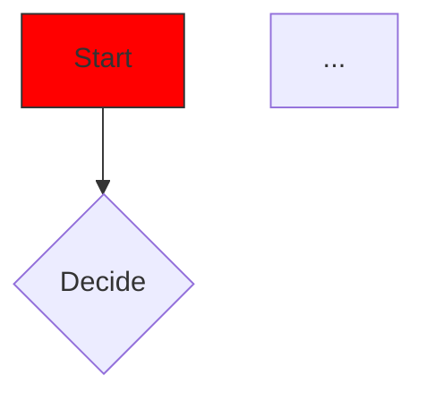

# Mermaid Hex Helper


**Mermaid Hex Helper** is a plugin that improves the experience of working with colors in Markdown (`.md`) and Mermaid (`.mmd`) files. It automatically detects HEX color codes, displays a preview, and allows you to edit them visually.

## Features
- **Gutter Color Preview**: Automatically detects HEX colors (e.g., `#FF5733`, `#abc`) in your text and displays a color preview icon in the editor gutter.
- **One-Click Edit**: Click on the color icon to open the native **Color Picker**
- **Mermaid.js Support**: Works perfectly with Mermaid diagrams!
    - Support for `.mmd` files
    - Detection inside ` ```mermaid ` blocks in Markdown files

## Screenshots

## Usage

Just type a HEX code in any `.md` or `.mmd` file:
```

